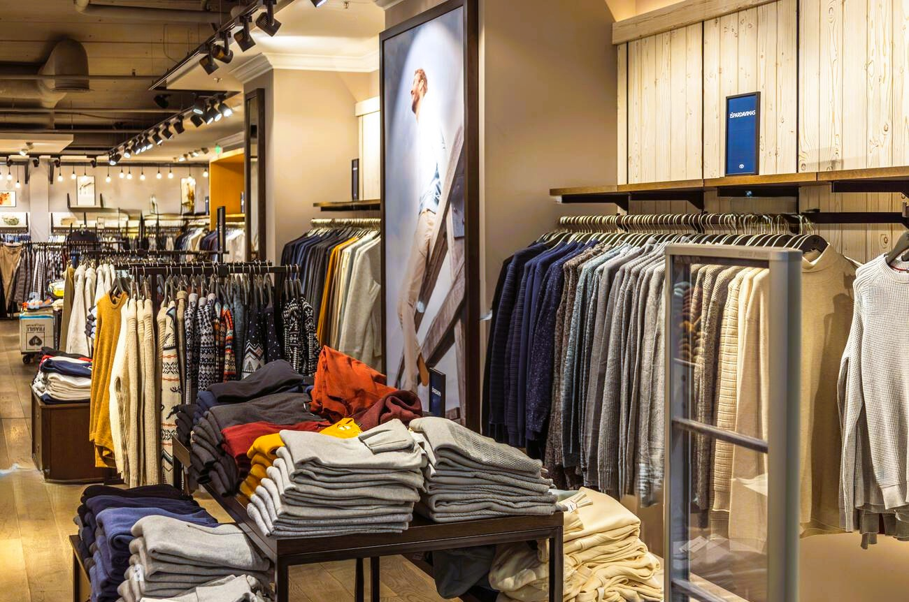
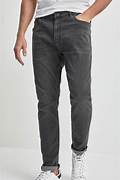

# MR_AURA - Responsive Clothing E-Commerce Login System

Welcome to **MR_AURA**, a sleek and modern front-end e-commerce login interface built using pure **HTML**, **CSS**, and **JavaScript** (with all code inline). This project includes fully functional **Login**, **Sign Up**, and **Forgot Password** features with OTP simulation and localStorage support — all without a backend!

---

## 🔥 Features

- ⚡ Fully responsive login/signup UI
- 🔒 OTP-based verification for account creation and password reset
- 💾 LocalStorage for storing user accounts securely (simulated)
- 🎨 Stylish dark-themed design with custom MR_AURA logo
- ✅ Includes image-rich product pages and cart system
- 📱 Mobile and desktop friendly

---

## 🚀 Live Demo

🔗 [Click here to view the live project](https://Sai934-v.github.io/mr_aura_project/)

---

## 📸 Screenshots

| Login Page | Signup Form | Product Page |
|------------|-------------|---------------|
|  |  |  |

---

## 🛠️ Technologies Used

- **HTML5** – Structure
- **CSS3** – Styling (Inline)
- **JavaScript** – Logic and interactions
- **GitHub Pages** – Hosting

---

## 📁 Project Structure

